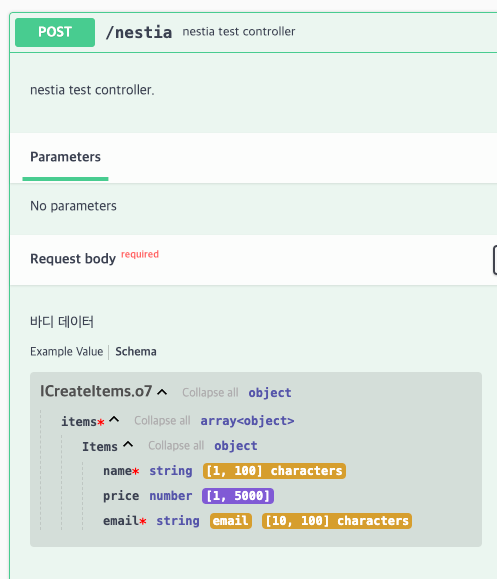

<p align="center">
  <a href="http://nestjs.com/" target="blank"></a>
</p>

[circleci-image]: https://img.shields.io/circleci/build/github/nestjs/nest/master?token=abc123def456

[circleci-url]: https://circleci.com/gh/nestjs/nest

  <p align="center">A progressive <a href="http://nodejs.org" target="_blank">Node.js</a> framework for building efficient and scalable server-side applications.</p>
    <p align="center">
<a href="https://www.npmjs.com/~nestjscore" target="_blank"></a>
<a href="https://www.npmjs.com/~nestjscore" target="_blank"></a>
<a href="https://www.npmjs.com/~nestjscore" target="_blank"></a>
<a href="https://circleci.com/gh/nestjs/nest" target="_blank"></a>
<a href="https://coveralls.io/github/nestjs/nest?branch=master" target="_blank"></a>
<a href="https://discord.gg/G7Qnnhy" target="_blank"></a>
<a href="https://opencollective.com/nest#backer" target="_blank"></a>
<a href="https://opencollective.com/nest#sponsor" target="_blank"></a>
  <a href="https://paypal.me/kamilmysliwiec" target="_blank"></a>
    <a href="https://opencollective.com/nest#sponsor"  target="_blank"></a>
  <a href="https://twitter.com/nestframework" target="_blank"></a>
</p>
  <!--[](https://opencollective.com/nest#backer)
  [](https://opencollective.com/nest#sponsor)-->

## Description

- [Nestia](https://nestia.io/) nestia를 활용하여 data validation부터 SDK 까지 활용해보는 레포지토리 입니다.<br>
- Nestia는 TypeScript 기반의 NestJS 프로젝트에서 자동 API 문서화 및 타입 안전성을 제공하는 라이브러리입니다.

## Project setup

```bash
$ yarn install
```

## 초기 세팅 - Nest 의 구조를 유지하며, nestia setup 하는 법

```bash
# nest 프로젝트 생성
$ nest new <project이름>

# nestia 패키지 설치
$ yarn add --dev nestia

# nestia setup wizard 활용
$ npx nestia setup
```

# nestia/core vs class-validator & class-transformer

## nestia 설정 컨트롤러

### @nesita/core의 @TypedBody()에서 검증하는 interface

```ts 
export interface IItem {
  /**
   * @minLength 1
   * @maxLength 100
   */
  name: string;

  /**
   * @minimum 1
   * @maximum 5000
   * @example 5000
   */
  price?: number;

  /**
   * @format email
   * @minLength 10
   * @maxLength 100
   */
  email: string;
}

export interface ICreateItems {
  items: IItem[];
}
```
- nestia는 typia를 활용해, pure TypeScript type 만을 활용해서 DTO를 정의할수 있습니다.
- nestia의 validate 규칙은 주석 설명([typia](typia-comment tags 설명 기반))을 따릅니다.
- 클래스가 아닌 인터페이스로 검증이 가능합니다.
- 부트스트랩에서 Global Pipe를 넣을 필요도 없음!!! 

---

### netia/core를 활용한 post 컨트롤러

```typescript 
/**
 * nestia test controller.
 *
 * @param body 바디 데이터
 */
@TypedRoute.Post('nestia')
createItemsNestia(@TypedBody() body: ICreateItems):  string
{
  const count = body.items.length;
  return `${count} items processed successfully!`;
}
```

- TypedRoute의 메서드들은 일반적인 Nest 메서드들보다 더 빠른 JSON.stringify 성능을 가지고 있다고 합니다.
- 주석을 통해 Swagger, 혹은 sdk 상에서 노출될 설명을 작성합니다.
- @nestjs/swaager의 데코레이터로 설명을 작성하지 않아도 되니 쫌더 간편하기도 하네요.

---


- 위 인터페이스 및 컨트롤러 설정을 통해 swagger 상에서 표기는 이렇게 노출됩니다.

---

## 기존 Nest controller

- 성능테스트를 위한 비교군으로, 인터페이스와 동일한 구조의 Dto, @nestjs/common의 post, body 데코레이터를 가지는 컨트롤러입니다.

### 기존 class-validator, class-transformer 를 활용한 dto

```typescript
export class ItemDto {
  @IsString()
  @MinLength(1)
  @MaxLength(100)
  name: string;

  @IsOptional()
  @IsNumber()
  @Min(1)
  @Max(5000)
  price?: number;

  @IsString([app.controller.ts](src / app.controller.ts))
  @IsEmail()
  @MinLength(10)
  @MaxLength(100)
  email: string;
}

export class CreateItemsDto {
  @IsArray()
  @ValidateNested({ each: true })
  @Type(() => ItemDto)
  items: ItemDto[];
}
```
---
### @nestjs/common 데코레이터를 활용한 컨트롤러 
~~~ts
@Post('cl')
createItemsClassValidator(@Body() body: CreateItemsDto): string {
  const count = body.items.length;
  return `${count} items processed successfully!`;
}
~~~
---
## 성능 비교
- Apache Jmeter 를 활용하여 성능을 테스트합니다.
- 빌드 후 pm2 클러스터링(인스턴스 2개) Nest 프레임워크를 실행했습니다.
- 각 컨트롤러에 1000개의 유저가 5번의 루프카운트 동안 요청을 하도록 스레드 프로퍼티를 설정을 하고, TPS를 비교해보았습니다.
### test 환경
  - 운영 체제
    - macOS Monterey 12.3
  - 하드웨어 사양
    - **CPU**: Apple M1 Chip (8-core)
    - **RAM**: 16GB Unified Memory
    - **디스크**: 250GB SSD
### 데이터 예시
- JSON 직렬화, 각 배열의 값 검증의 부하를 주기 위해 아래와 같이 body에 데이터를 전달하도록 설정하였습니다.
~~~json
{
  "items": [
    {
      "name": "Item 1",
      "price": 100,
      "email": "test@test.com"
    },
    {
      "name": "Item 2",
      "price": 300,
      "email": "test@test.com"
    },,, // 1000개의 elements
  ]
}
~~~

## jMeter 부하 테스트 결과

| controller                 | Samples | Average(평균처리시간) | Throughput(TPS) |
|----------------------------|---------|-----------------|-----------------|
| nestia controller          | 5000    | 179             | 2173.9/sec      |
| class-validator controller | 5000    | 568             | 323.2/sec       |

- 유의미한 결과가 도출되었습니다. 작업 환경으로 더 큰 부하를 주는 테스트는 어렵지만, 적어도 6배이상의 속도차이는 보이네요

## 결론
1. class-validator와 class-transformer는 리플렉션(reflection) API와 메타데이터를 사용하여 검증 및 변환을 수행합니다. 이러한 처리과정은 느리고, 많은 커뮤니티에서도 성능지적을 하고있어요
2. Nestia는 컴파일 타임에서도 타입체크가 가능하도록 설계되어 있습니다. 오버헤드를 많이 줄일 수 있을듯합니다.
3. 설정도 간편하고, Swagger Docs에서도 유효성이 충분히 표기됩니다. 사용성이 더높아보이네요
4. DB 관련 레포지토리도, dto보단 interface를 활용하여 리턴값으로 사용하는 편이 성능을 더올릴수 있겠죠?


## TODO

### Nestia SDK 활용
- [ ] SDK npm에 퍼블리싱
- [ ] SDK F/E에서 활용

## 참고자료
https://dev.to/samchon/nestia-boost-up-your-nestjs-server-much-faster-and-easier-maximum-20000x-faster-59o5

## License

Nest is [MIT licensed](https://github.com/nestjs/nest/blob/master/LICENSE).<br>
Nestia is [MIT licensed](https://github.com/nestjs/nest/blob/master/LICENSE).
